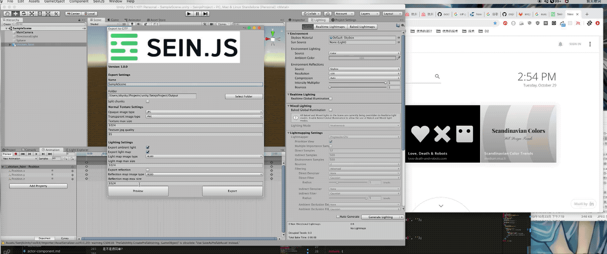
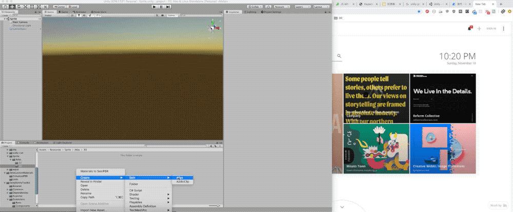

# SeinJSUnityToolkit

Export unity scene to gltf for "Sein.js", or import gltf to unity.

**Preview:**

**Atlas and sprite:**

## Usage

http://seinjs.com/cn/guide/unity

## Features

1. Export and import node, mesh, material, texture, lights, cameras...
2. Support animations.
3. Support texture compression.
4. Support custom materials.
5. Support binding scripts.
6. Support physic system.
8.  Support lightmap.
9.  Support customize gltf extensions.
10. Support import and export morph.
12. Support import multiple primitives mesh and its hierarchy in unity(by using sub meshes).
13. Support interleaved primitives.
14. Add Sein/PBR material to replace Unity Standard material.
15. Support IBL: SH and Reflection.
16. Support ambient light.
17. Support linear color space.
18. Support SeinJS atlas.
19. Support SeinJS Sprite.
20. Support SeinJS Material Scripts.
21. Support preview and inspector.
22. Support cubmap.
23. Support skybox.
24. Support HDR texture.
